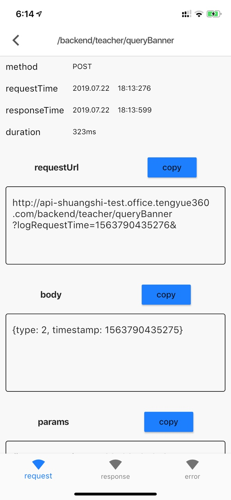
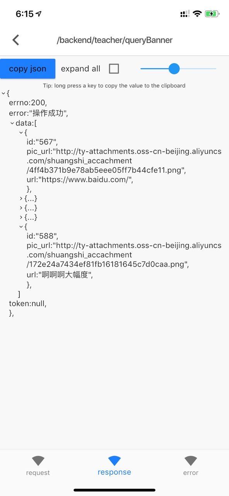

# dio_log

http requests log of dio

### Add dependency
dependencies:
  dio_log : 1.0.3 #^latest_version
### set interceptor of dio
```
dio.interceptors.add(HttpLogInterceptor());
```
### open log of dio list
``` 
Navigator.of(context).push(
    MaterialPageRoute(
      builder: (context) => HttpLogListWidget(),
    ),
  );
```
###Screenshot 

      


